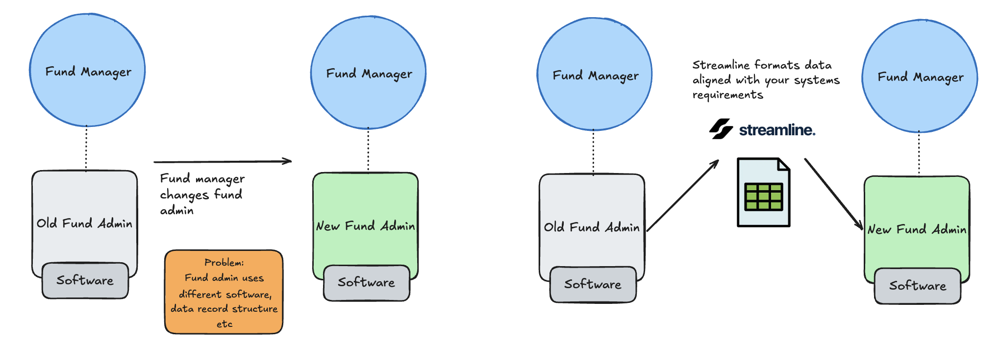

# Streamline



Streamline helps fund administrators prepare a new client’s accounting records for their own system.

When a fund changes administrators, its historical records arrive with the old system’s names, identifiers and accounting categories. Streamline translates those records into the destination’s format, highlights uncertain matches for review, and checks that the amounts are preserved.

## How it works

1. **Load the records.** Use the supplied demo or upload a supported accounting workbook.
2. **Review decisions.** Inspect the original fields and proposed destination. Approve a match or request clarification.
3. **Check the numbers.** Code compares original and prepared amounts, including debit/credit totals and record coverage.
4. **Export.** Compare the Original Data tab (old format) with Upload Template (prepared format), alongside reconciliation checks and a migration summary. A detailed audit package includes mappings, decisions and source references.

Unresolved decisions and failed checks block verified export. Original source files are retained.

## Gemini’s role

Gemini investigates a bounded sample of source records and reference mappings. It provides a recommendation, supporting evidence, uncertainty and a concrete next action. Suggestions are validated against existing target candidates.

**AI advises. Code checks the numbers. The administrator approves.**

## The demo

Click **Try the 3-minute demo** for an introduction to Westvale’s handover, then review **528 accounting records and two decisions**:

- Whether entries belong to general fund operations or a specific investment.
- Whether entries labelled as bank interest should be classified as administration fees.

The demo uses one complete fund from the supplied anonymised dataset. The destination template and reference mappings are preconfigured for Corvus. It produces an Excel package; it does not connect to a live fund administration system.

## Run locally

Requires Node.js 22+. Spreadsheet parsing preserves the original decimal text.

```bash
npm install
npm run preprocess
npm run dev
```

Open **http://localhost:3000**. Development mode updates the UI when you save.

For Gemini, copy `.env.example` to `.env.local` and configure either Vertex AI credentials or a Gemini API key. Restart the server after changing environment settings. Without AI credentials, reference-based investigation remains available.

```bash
npm test          # Validate the migration logic
npm run build    # Build for production; stop the dev server first
npm start        # Serve the production build
```

## MVP scope

Built with Next.js, TypeScript, Gemini, Decimal.js and Excel processing tools. This is a single-user hackathon application without user accounts. Uploads support the supplied accounting layout, not arbitrary spreadsheets. Live imports and destination-system record creation are outside its scope.

## Vercel

On Vercel, cases and datasets use a connected private Blob store; local development continues to use `.local`. Browser uploads go directly to private storage to support files up to 30 MB. Conditional writes prevent one review from overwriting a newer saved decision.

Connect a private Vercel Blob store for `BLOB_READ_WRITE_TOKEN`, then run `npx vercel --prod`. The supplied workbooks are bundled; local credentials and saved cases are excluded. Vertex AI needs a separate Google cloud authentication setup on Vercel: your Mac’s ADC login is not deployed. Until configured, investigation uses reference-based fallback.

See [the dataset README](data/README.md) and [architecture notes](docs/architecture.md) for details.
